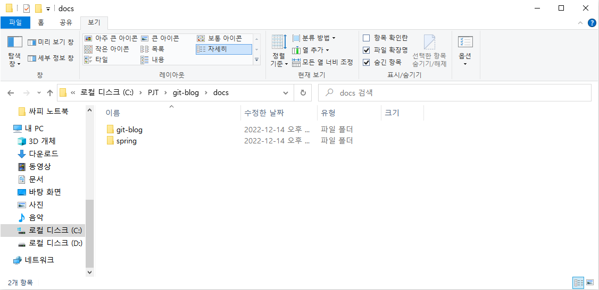
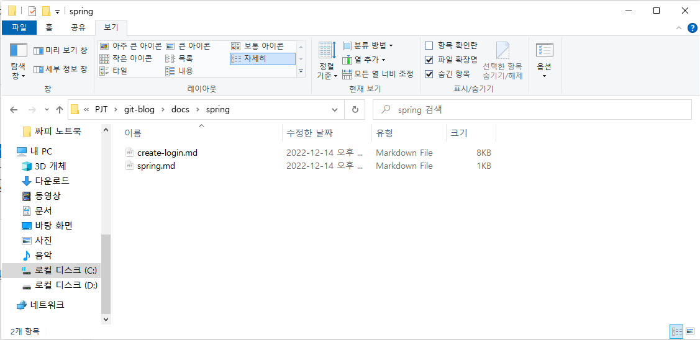

# Write Article

{: .no_toc }

## Table of contents

{: .no_toc .text-delta }

{:toc}

---

## Theme

현재 사용하고 있는 테마는 "[Just-the-Docs](https://jekyllthemes.io/theme/just-the-docs)" 이다.

해당 테마는 글을 깔끔하게 작성할 수 있고, 무엇보다 내가 좋아하는 <span style="color:purple">보라색</span> 이어서 선택하여 사용하게 되었다.


이 외에도 더 많은 무료 테마는 아래의 링크로 이동하면 볼 수 있다.

👉 [무료 Jekyll 테마 보러가기](https://jekyll-themes.com/free/)


테마를 적용하는 방법은 해당 테마의 Repository로 이동하여 Clone하는 방법도 있지만, 나는 해당 테마의 Repository를 ZIP으로 다운받아 나의 Repository에 Push하는 방법을 사용하였다.

👉 [적용한 Git Repository 이동하기](https://github.com/Soyeong4250/Soyeong4250.github.io)


## 작성 방법

처음 Git Blog를 접하게 되면 테마를 적용까지는 어찌저찌했는데...

근데 글은 어떻게 작성하는거지..❓

보통 게시판에는 글작성 버튼이 있는데 Git Blog는 글작성 버튼이 없다.


우리가 Git Blog에 글을 작성하기 위해서는 로컬 또는 Git Repository에서 Markdown 형식으로 글을 작성하고 이를 Git Repository에 Push하여야 적용이 된다.

현재 사용하고 있는 Just-the-Docs 테마는 docs 폴더에 마크다운 형태의 글을 작성하면 적용이 가능하다.


다음 단계를 천천히 따라가보며 글을 작성해보자. 나는 이전에 구현해보았던 로그인 기능을 구현하는 글에 대해 써보았다.


### 1️⃣ docs 폴더 내에 spring이란 이름의 폴더를 생성하기



### 2️⃣ 부모 Markdown 문서와 자식 Markdown 문서 작성하기



 

위의 두 Markdown 문서의 내용은 아래와 같다.

**spring.md**

```Mark
---
layout: default
title: Spring
nav_order: 1
has_children: true
permalink: /docs/spring
---


Spring에 대해 알아보자.


{: .fs-6 .fw-300 }
```

**create-login.md**

````mark
---
layout: default
title: 로그인 구현하기
parent: Spring
nav_order: 1
---

# 로그인 구현하기

{: .no_toc }

## Table of contents

{: .no_toc .text-delta }

{:toc}

---

# 📌 로그인

### 로그인 실패하는 경우 예외 처리 하기

**UserRestController**

```java
package com.hospital.review.controller;

import com.hospital.review.domain.dto.*;
import com.hospital.review.domain.entity.Response;
import com.hospital.review.service.UserService;
import lombok.RequiredArgsConstructor;
import lombok.extern.slf4j.Slf4j;
import org.springframework.web.bind.annotation.PostMapping;
import org.springframework.web.bind.annotation.RequestBody;
import org.springframework.web.bind.annotation.RequestMapping;
import org.springframework.web.bind.annotation.RestController;

@RestController
@Slf4j
@RequiredArgsConstructor
@RequestMapping("/api/v1/users")
public class UserRestController {

    private final UserService userService;

    @PostMapping("/login")
    public Response<UserLoginResDto> login(@RequestBody UserLoginReqDto userLoginReqDto) {
        String token = userService.login(userLoginReqDto.getUserName(), userLoginReqDto.getPassword());
        return Response.success(new UserLoginResDto(token));
    }
}
```

- 요청 시 UserName과 Password를 받아오고, 응답 시 Token 발행

이하 생략
````

